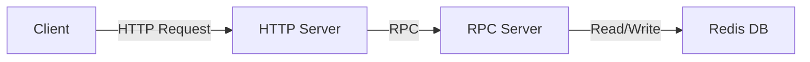

# TikTok Server Assignment 2023

This repo contains the code for a backend server for an instant messaging system.
Users can send messages to other users and pull their messages.
This project was done for TikTok Tech Immersion 2023.

## Tech Stack

- Go
- Redis
- Docker
- Protobuf
- [Kitex](https://github.com/cloudwego/kitex)
- [Thriftgo](https://github.com/cloudwego/thriftgo)

## Architecture

## How to start the server

1. Be sure to have Go 1.18+ and Docker installed
2. Install the dependency tools by running `make pre`
3. Run `docker-compose up -d`. If successful, the server should now be listening on port 8080
4. Check if the server has started by running `curl localhost:8080/ping`

## How to send a message

Send a message by making a `POST` request to `localhost:8080/api/send` with a JSON body containing these fields:

| Param    | Type     | Description                                                                                           |
|----------|----------|-------------------------------------------------------------------------------------------------------|
| `chat`   | `string` | A string containing the two users the message is sent between, in the format `"user1:user2"`          |
| `text`   | `string` | The content of the message                                                                            |
| `sender` | `string` | The user who sent the message. This must be one of the users in the chat or an error will be returned |

## How to pull messages

Pull the messages sent between two users by making a `GET` request to `localhost:8080/api/pull` with a JSON body containing these fields:

| Param     | Type      | Description                                                                                                |
|-----------|-----------|------------------------------------------------------------------------------------------------------------|
| `chat`    | `string`  | A string containing the two users whose messages should be pulled, in the format `"user1:user2"`           |
| `cursor`  | `number`  | The index of the first message to pull based on send time                                                  |
| `limit`   | `number`  | The maximum number of messages to return                                                                   |
| `reverse` | `boolean` | Messages will be returned in chronological order by default. Set this param to `true` to reverse the order |

If there are more messages to be pulled after the last message returned, the JSON response will also contain `has_more` (which will be set to `true`) and `next_cursor`.
`next_cursor` will contain the index of the next message that can be pulled. 